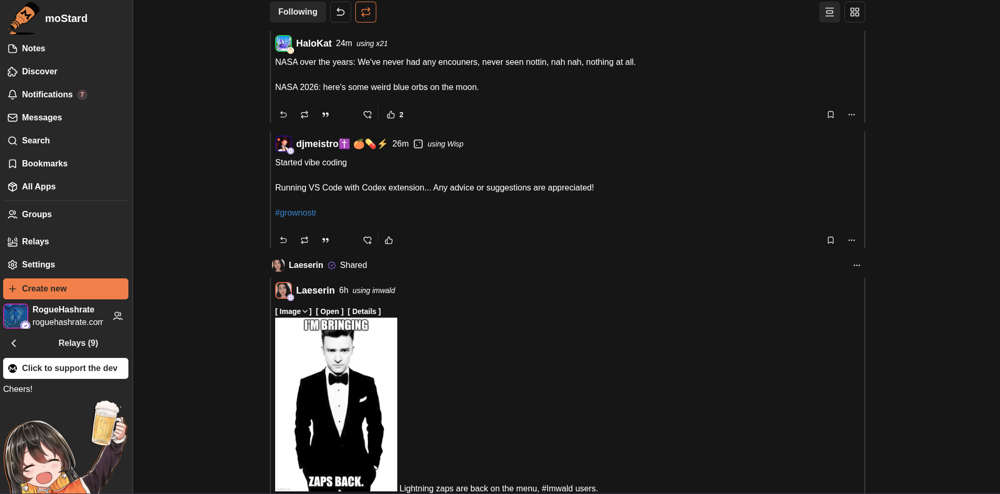
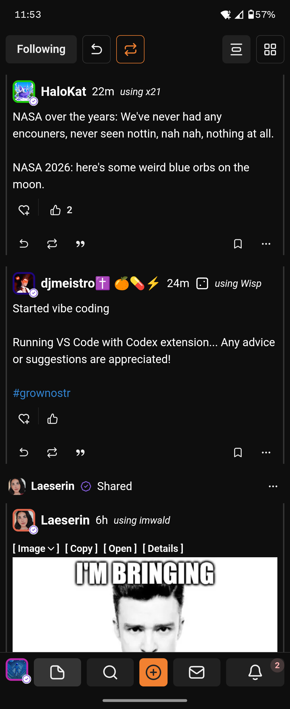
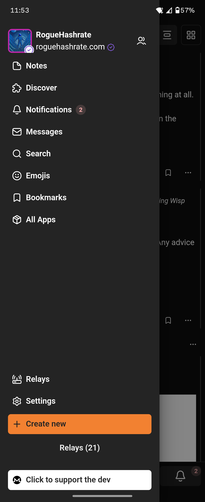

<p align="center">
  
</p>

<h1 align="center">moStard</h1>

<p align="center">
  <em>A Monero-first nostr client.</em>
</p>

<p align="center">
  
  
</p>

## Screenshots

<p align="center">
  
  
  
</p>

## Getting Started

```bash
git clone https://github.com/roguehashrate/moStard.git
cd moStard
pnpm install
pnpm run dev
```

## Security

Please <b>don't trust</b> my app with your <b>nsec</b>. Use a dedicated signer instead:

- **Android** — [Amber](https://github.com/greenart7c3/Amber)
- **Chrome** — [Ditto Extension](https://chromewebstore.google.com/detail/ditto-extension/fbiegkepanmjielbemkhieckmlckiagi) or [nos2x](https://chromewebstore.google.com/detail/nos2x/kpgefcfmnafjgpblomihpgmejjdanjjp)
- **Firefox** — [nos2x-fox](https://addons.mozilla.org/en-US/firefox/addon/nos2x-fox/)

## Contributing

See [CONTRIBUTING.md](CONTRIBUTING.md). Open to PR's, make sure you explain what your PR is and why.

## Support

 <br> Any and all donations are appreciated.
_883nEtA4WKewhvYVMhQfPEqN6MMvrgNR2UNmGd4aw46K9CM8x52BovowaR8kCmf3FzAMndydTL682thK7YsCrwKKL8RRfsQy_
